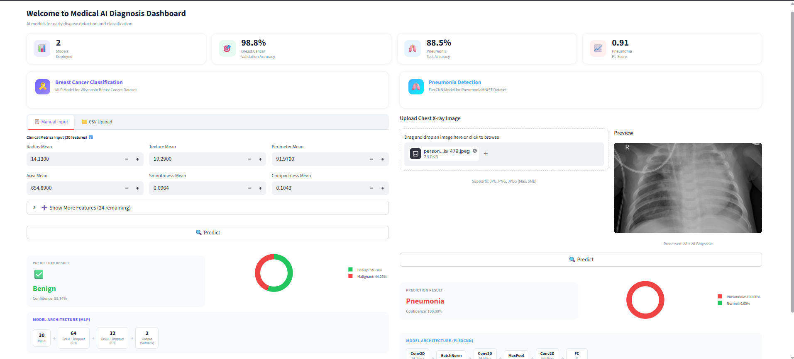

# Medical AI Diagnosis Dashboard 

An AI-powered medical diagnosis system featuring deep learning models for early disease detection and classification. Built with a minimalist, functional, and modern UI using Streamlit.

## Screenshots
<div align="center">
  
  <br>
  <em>Main Dashboard Interface</em>
</div>

<br>

## Features

*   **Breast Cancer Classification (MLP Model)**:
    *   Trained on the Wisconsin Breast Cancer Dataset.
    *   Predicts Benign or Malignant based on 30 clinical features.
    *   Supports manual input or bulk predictions via CSV upload.
    *   Displays prediction confidence with interactive Donut Charts.
*   **Pneumonia Detection (FlexCNN Model)**:
    *   Trained on the PneumoniaMNIST Dataset.
    *   Analyzes Chest X-ray images (supports drag-and-drop JPG, PNG, JPEG formats).
    *   Provides "Pneumonia" or "Normal" classification with real-time confidence scores.
*   **Modern Interactive Dashboard**:
    *   Minimalist, user-friendly UI with an intuitive sidebar navigation.
    *   Custom CSS styling with responsive grid layouts.

## 💻 Tech Stack

*   **Frontend / UI**: [Streamlit](https://streamlit.io/)
*   **Deep Learning**: [PyTorch](https://pytorch.org/)
*   **Machine Learning**: [scikit-learn](https://scikit-learn.org/)
*   **Data Visualization**: [Plotly](https://plotly.com/)
*   **Data Processing**: Pandas, NumPy, Pillow

## Installation & Setup

1. **Clone the repository:**
   ```bash
   git clone <repository-url>
   cd medical-ai-dashboard
   ```

2. **Create a virtual environment (Optional but recommended):**
   ```bash
   python -m venv .venv
   source .venv/bin/activate  # On Windows use `.venv\Scripts\activate`
   ```

3. **Install the dependencies:**
   Make sure to install the required libraries (Streamlit, PyTorch, Plotly, Pandas, etc.).
   ```bash
   pip install streamlit torch scikit-learn plotly pandas numpy Pillow
   ```
   *(Note: This project uses Python 3.13+)*

4. **Run the Dashboard:**
   ```bash
   streamlit run main.py
   ```

## Project Structure

*   `main.py`: Application entry point and sidebar router.
*   `views/dashboard.py`: Main dashboard layout integrating both models and prediction logic.
*   `assets/style.css`: Custom CSS styling for the Streamlit application.
*   `utils/mlp_model.py`: Helpers for Breast Cancer MLP predictions.
*   `utils/cnn_model.py`: Helpers for Pneumonia FlexCNN predictions.
*   `models/`: Directory storing the trained model weights and scalers.

##Disclaimer

This application was developed as a university project for educational and research purposes only. The AI predictions are experimental and are **not** intended for real medical diagnosis, clinical use, or as a substitute for professional medical advice.
